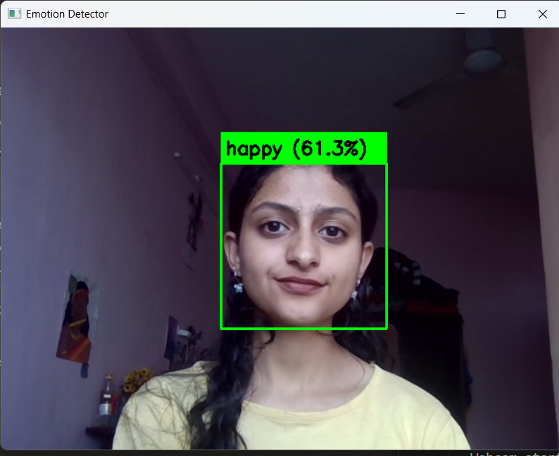

# 😊 Emotion Detector CV

A real-time face detection and emotion recognition system built with Python and OpenCV. This project uses deep learning to detect faces and classify emotions from both static images and live webcam feed.

## Features

- Detects faces in images and live webcam feed
- Classifies 7 emotions: Angry, Disgust, Fear, Happy, Sad, Surprise, Neutral
- Real-time webcam emotion detection
- GPU accelerated (CUDA supported)

##  Tech Stack

- Python 3.13
- OpenCV
- TensorFlow / Keras
- DeepFace
- CUDA (NVIDIA GeForce RTX 3050)

##  Project Structure
emotion-detector-cv/
│
├── project1_face.py        # Face detection on static images
├── project1_emotion.py     # Emotion detection on static images
├── project1_webcam.py      # Real-time webcam emotion detection
├── test.jpg                # Sample test image
└── README.md
## ⚙️ Installation
```bash
# Clone the repository
git clone https://github.com/asthaattri/emotion-detector-cv.git
cd emotion-detector-cv

# Create virtual environment
python -m venv cvenv
.\cvenv\Scripts\activate

# Install dependencies
pip install opencv-python deepface tensorflow
```

## ▶️ Usage
```bash
# Face detection on image
python project1_face.py

# Emotion detection on image
python project1_emotion.py

# Real-time webcam detection
python project1_webcam.py
```

##  Sample Output

## ⚠️ Limitations

- Emotion detection accuracy depends on lighting conditions and face angle
- Works best with frontal, well-lit faces

##  Future Improvements

- Add multi-face emotion tracking
- Improve accuracy with custom trained model
- Add emotion history graph over time

##  Author

**Astha Attri**  
B.Tech Student | Computer Vision Enthusiast  
[GitHub](https://github.com/asthaattri)
